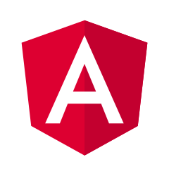

# DWEC UT05: Introducción a los frameworks: React.

Comenzaremos nuestro repaso a los frameworks con una visión general del área, una breve historia de JavaScript y los frameworks, por qué existen los frameworks y qué nos aportan, cómo empezar a pensar en la elección de un framework para aprender y qué alternativas hay a los frameworks del lado del cliente.

## Breve historia de JavaScript

Cuando JavaScript debutó en 1996, añadió interactividad ocasional y emoción a una web que, hasta entonces, se componía de documentos estáticos. La web se convirtió no sólo en un lugar para **leer cosas**, sino para **hacer cosas**. La popularidad de JavaScript no dejó de crecer. Los desarrolladores que trabajaban con JavaScript escribían herramientas para resolver los problemas a los que se enfrentaban y las empaquetaban en paquetes reutilizables llamados **bibliotecas**, para poder compartir sus soluciones con los demás. Este ecosistema compartido de bibliotecas ayudó a dar forma al crecimiento de la web.

Ahora, JavaScript es una parte esencial de la web, se utiliza en el 98% de los sitios web, y la web es una parte esencial de la vida moderna. Los usuarios escriben documentos, gestionan sus presupuestos, escuchan música, ven películas y se comunican con otros a grandes distancias de forma instantánea, con texto, audio o videochat. La web nos permite hacer cosas que antes sólo eran posibles en aplicaciones nativas instaladas en nuestros ordenadores. Estos sitios web modernos, complejos e interactivos suelen denominarse aplicaciones web (webApps). 

La aparición de los modernos frameworks de JavaScript ha facilitado enormemente la creación de aplicaciones interactivas y muy dinámicas. Un **framework** es una biblioteca que ofrece opiniones sobre cómo se construye el software. Estas opiniones permiten la previsibilidad y la homogeneidad en una aplicación; la previsibilidad permite al software escalar a un tamaño enorme y aún así ser mantenible; la previsibilidad y la mantenibilidad son esenciales para la salud y la longevidad del software.

## Frameworks disponibles

Existen muchos frameworks, pero actualmente se considera que los "cuatro grandes" son los siguientes.

**Ember**

[Ember](https://emberjs.com/) fue lanzado inicialmente en diciembre de 2011 como una continuación del trabajo que comenzó en el proyecto [SproutCore](https://en.wikipedia.org/wiki/SproutCore). Es un framework más antiguo que tiene menos usuarios que alternativas más modernas como React y Vue, pero aún goza de bastante popularidad debido a su estabilidad, el apoyo de la comunidad y algunos principios de codificación inteligentes.

<p align="center"> 

</p>

**Angular**

[Angular](https://angular.io/) es un framework de aplicaciones web de código abierto liderado por el equipo de Angular en Google y por una comunidad de individuos y corporaciones. Es una reescritura completa del mismo equipo que construyó [AngularJS](https://angularjs.org/). Angular fue lanzado oficialmente el 14 de septiembre de 2016.

Angular es un framework basado en componentes que utiliza plantillas HTML **declarativas**. En el momento de la compilación, de forma transparente para los desarrolladores, el compilador del framework **traduce las plantillas a instrucciones JavaScript optimizadas**. Angular utiliza [TypeScript](https://www.typescriptlang.org/), un lenguaje de programación parecido a JavaScript.

<p align="center"> 

</p>

**Vue**

Después de trabajar y aprender del proyecto AngularJS original, Evan You lanzó [Vue](https://vuejs.org/) en 2014. Vue es el más joven de los cuatro grandes, pero ha disfrutado de un reciente repunte en popularidad.

Vue, al igual que AngularJS, extiende HTML con parte de su propio código. Aparte de eso, se basa principalmente en JavaScript moderno y estándar.

<p align="center"> 

</p>

**React**

Facebook lanzó [React](https://react.dev/) en 2013. En ese momento, ya había estado utilizando React para resolver muchos de sus problemas internamente. **Técnicamente, React en sí no es un framework**; es una biblioteca para renderizar componentes de interfaz de usuario. React se utiliza en combinación con otras bibliotecas para crear aplicaciones: React y React Native permiten a los desarrolladores crear aplicaciones móviles; React y ReactDOM les permiten crear aplicaciones web, etc.

Debido a que React y ReactDOM se utilizan a menudo juntos, React se entiende coloquialmente como un framework JavaScript. A medida que leas este módulo, trabajaremos con esa interpretación coloquial.

React extiende JavaScript con una sintaxis similar a HTML, conocida como [JSX](https://react.dev/learn/writing-markup-with-jsx).

<p align="center"> 

</p>

## ¿Por que existen los frameworks?

Consideremos un tipo común de aplicación: Un creador de listas de tareas. Esta aplicación debe permitir a los usuarios hacer cosas como mostrar una lista de tareas, añadir una nueva tarea y eliminar una tarea; y debe hacerlo al mismo tiempo que rastrea y actualiza de forma fiable los datos subyacentes a la aplicación. En desarrollo de software, estos datos subyacentes se conocen como estado.

Cada uno de nuestros objetivos es teóricamente sencillo por separado. Podemos iterar sobre los datos para renderizarlos; podemos añadir a un objeto para hacer una nueva tarea; podemos usar un identificador para encontrar, editar o borrar una tarea. Cuando recordamos que la aplicación tiene que permitir al usuario hacer todas estas cosas a través del navegador, empiezan a aparecer algunas grietas. El verdadero problema es el siguiente: cada vez que cambiamos el estado de nuestra aplicación, tenemos que actualizar la interfaz de usuario para que coincida.

Construir elementos HTML y mostrarlos en el navegador en el momento adecuado requiere una sorprendente cantidad de código. Digamos que nuestro estado es una matriz de objetos estructurada así:

```js
const state = [
  {
    id: "todo-0",
    name: "Learn some frameworks!",
  },
];
```

¿Como hariamos para mostrar las tareas a los usuarios si queremos mostrar cada tarea como un `li` dentro de un `ul`?

```js
function buildTodoItemEl(id, name) {
  const item = document.createElement("li");
  const span = document.createElement("span");

  span.textContent = name;

  item.id = id;
  item.appendChild(span);
  item.appendChild(buildDeleteButtonEl(id));

  return item;
}

function buildDeleteButtonEl(id) {
  const button = document.createElement("button");
  button.setAttribute("type", "button");
  button.textContent "Delete";

  return button;
}

// funcion para renderizar la lista
function renderTodoList() {
  const frag = document.createDocumentFragment();
  state.forEach((task) => {
    const item = buildTodoItemEl(task.id, task.name);
    frag.appendChild(item);
  });

  // borramos/actualizamos la lista
  while (todoListEl.firstChild) {
    todoListEl.removeChild(todoListEl.firstChild);
  }
  todoListEl.appendChild(frag);
}
```

Ahora tenemos casi treinta líneas de código dedicadas sólo a la interfaz de usuario, sólo para representar algo en el DOM, ¡y en ningún momento añadimos clases que podríamos usar más tarde para dar estilo a los elementos de nuestra lista!

Trabajar directamente con el DOM, como en este ejemplo, requiere entender muchas cosas sobre cómo funciona el DOM: cómo hacer elementos; cómo cambiar sus propiedades; cómo poner elementos unos dentro de otros; cómo ponerlos en la página. Nada de este código maneja realmente las interacciones del usuario, o aborda la adición o eliminación de una tarea. Si añadimos esas funciones, tenemos que acordarnos de actualizar nuestra interfaz de usuario en el momento adecuado y de la forma correcta.

Los **frameworks de JavaScript se crearon para facilitar este tipo de trabajo**: existen para ofrecer una mejor experiencia al desarrollador. No aportan nuevos poderes a JavaScript, sino que le facilitan el acceso a los poderes de JavaScript para que pueda construir para la web actual.

Cada framework JavaScript ofrece una forma de escribir interfaces de usuario de forma más **declarativa**. Es decir, te permiten escribir código que describe cómo debe ser tu interfaz de usuario, y el *framework lo hace realidad en el DOM entre bastidores*.

El enfoque de vainilla JavaScript  para construir nuevos elementos DOM en la repetición era difícil de entender a simple vista. Por el contrario, el siguiente bloque de código ilustra la forma en que podría utilizar `Vue` para describir nuestra lista de tareas:

```html
<ul>
  <li v-for="task in tasks" v-bind:key="task.id">
    <span>{{task.name}}</span>
    <button type="button">Delete</button>
  </li>
</ul>
```

Ya está. Este fragmento reduce casi treinta líneas de código a seis. Si las llaves y los atributos `v-` no te resultan familiares, no pasa nada; Lo importante es que este código se parece a la interfaz de usuario que representa, mientras que el código JavaScript convencional no.

## Ventajas que nos ofrecen los frameworks

Como hemos aludido antes, las ventajas de los frameworks son alcanzables en vanilla JavaScript, pero el uso de un framework elimina toda la carga cognitiva de tener que resolver estos problemas por ti mismo.

### Herramientas

Debido a que cada uno de los frameworks tiene una comunidad grande y activa, el ecosistema de cada framework proporciona herramientas que mejoran la experiencia del desarrollador. Estas herramientas hacen que sea fácil añadir cosas como las **pruebas** (para asegurarse de que su aplicación se comporta como debería) o **linting** (para asegurarse de que su código está libre de errores y estilísticamente consistente).

### Compartimentación

La mayoría de los principales frameworks animan a los desarrolladores a abstraer las distintas partes de sus interfaces de usuario en componentes: *trozos de código reutilizables y mantenibles que pueden comunicarse entre sí.* 
Todo el código relacionado con un componente determinado puede residir en un archivo (o en un par de archivos específicos), de modo que el desarrollador sepa exactamente dónde debe ir para realizar cambios en ese componente. En una aplicación JavaScript convencional, tendrías que crear tu propio conjunto de convenciones para lograr esto de una manera eficiente y escalable.

### Routing

La característica más esencial de la web es que permite a los usuarios navegar de una página a otra: al fin y al cabo, es una red de documentos interconectados. Cuando usted sigue un enlace en este mismo sitio web, su navegador se comunica con un servidor y obtiene nuevo contenido para mostrárselo. Al hacerlo, cambia la URL de la barra de direcciones. Puede guardar esta nueva URL y volver a la página más tarde. Tu navegador recuerda tu historial de navegación y te permite navegar hacia adelante y hacia atrás. Esto se llama enrutamiento del lado del servidor.

Las aplicaciones web modernas no suelen buscar y renderizar nuevos archivos HTML, sino que cargan un único HTML y actualizan continuamente el DOM en su interior (lo que se conoce como aplicaciones de una sola página o SPA) sin navegar a los usuarios a nuevas direcciones en la web. Cada nueva pseudopágina web suele denominarse **vista** y, por defecto, no se realiza ningún enrutamiento.

Cuando una SPA es lo suficientemente compleja y genera suficientes vistas únicas, es importante incorporar la funcionalidad de enrutamiento a la aplicación. La gente está acostumbrada a poder enlazar con páginas específicas de una aplicación, avanzar y retroceder en su historial de navegación, etc., y su experiencia se resiente cuando estas funciones web estándar no funcionan. Cuando el enrutamiento es manejado por una aplicación cliente de esta manera, se denomina enrutamiento del lado del cliente.