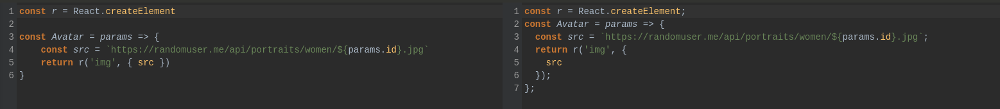
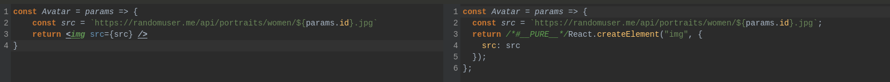

# DWEC UT05: Introducción a los frameworks: React.

## Introducción a React

Como su eslogan oficial señala, [React](https://es.react.dev/) es una biblioteca para construir interfaces de usuario. React no es un framework, ni siquiera se limita a la web. React es utilizado con otras bibliotecas para renderizar en ciertos entornos. Por ejemplo, **React Native** puede usarse para desarrollar aplicaciones móviles; **React 360** permite crear aplicaciones de realidad virtual; además de otras posibilidades.

Al desarrollar para la web, los desarrolladores usan **React** en conjunto con **ReactDOM**. React y ReactDOM son, a menudo, considerados al igual que -y utilizados para resolver los mismo problemas que- otros verdaderos frameworks de desarrollo web. Cuando nos referimos a React como un "framework", estamos trabajando con este significado coloquial.

El objetivo principal de React es minimizar los errores que ocurren cuando los desarrolladores construyen interfaces de usuario. Esto lo hace mediante el uso de **componentes**, piezas de código lógicas y auto-contenidas que describen una parte de la interfaz del usuario. Estos componentes se pueden juntar para crear una interfaz de usuario completa, y React abstrae la mayor parte del trabajo de renderizado, permitiéndote enfocarte en el diseño de la interfaz.

Si bien React puede usarse para pequeñas piezas de una interfaz, no resulta tan sencillo "introducirlo" en una aplicación como sería el caso de una biblioteca como jQuery -o incluso de un framework, como Vue-, por lo que viene a ser más abordable cuando construimos una aplicación completamente con React.

## Creando un componente con JavaScript

Imaginar que tenemos una web en el que tenemos que mostrar diferentes "avatares" del personal que tenemos trabajando en una empresa. Este "avatar" consta de una imagen, el nombre y el cargo que ostentan en la empresa (podria contener muchos otros datos).

```html
<!DOCTYPE html>
<html lang="en">
<head>
    <meta charset="UTF-8">
    <meta name="viewport" content="width=device-width, initial-scale=1.0">
    <style>
        picture {
            display: flex;
            flex-direction: column;
            text-align: center;
            width: 100px;
        }
        img {
            box-shadow: 0 0 15px #999;
            border-radius: 50%;
            width: 100px;
        }
        img.disabled {
            opacity: 0.3;
        }
    </style>
</head>
<body>
    <h1>EL PERSONAL DE DWEC</h1>
    <div id="app">
        <picture>
            
            <h2>Linda</h2>
            <span>CEO</span>
        </picture>
        <picture>
            
            <h2>Linda</h2>
            <span>CTO</span>
        </picture>
    </div>
</body>
</html>
```

Podemos observar que si necesitaramos ampliar el numero de empleados a mostrar, tendríamos que copiar y modificar tantas veces como quisiéramos todo el código del avatar (cada elemento `picture`). Pero este procedimiento no sería muy escalable ya que si quisieramos realizar cambios como añadir otra información a mostrar por cada avatar, se nos complicaría el trabajo.

Con los conocimientos que ya tenemos de JS, podriamos crear "componentes" dinamicamente en el script de una manera parecida a está.

```js
const app = document.getElementById("app")
const Avatar = params => {
    const src = `https://randomuser.me/api/portraits/women/${params.id}.jpg`
    return `<picture>
    
    <h2>${params.name}</h2>
    <span>${params.level}</spa>
    </picture>`
}
app.innerHTML += Avatar({ id: 4, name: "Linda", level: "CEO" })
app.innerHTML += Avatar({ id: 3, name: "Melisa", level: "CTO" })
```

De esta manera si quisieramos hacer algún cambio en el avatar, solo tendríamos que cambiar la parte que nos interasa y el cambio se vería reflejado en todos los "avatares".

```js
...
    return `<picture>
    
    <h2><em>${params.name}</em></h2>
    <span><b>${params.level}</b></span>
    </picture>`
...
```

## Utilizando React para crear componentes

Para entender como funciona React entre bambalinas vamos a utilizarlo de una manera poco ortodoxa (y de hecho no recomendada) pero nos servirá para asentar los conceptos. Seguiremos los pasos que nos indica en la documentación de React ([enlace](https://es.legacy.reactjs.org/docs/add-react-to-a-website.html)). Aunque haremos algunos cambios y no lo seguiremos tal cual aparece allí.

> CUIDADO!! Esta pagina de documentación esta ya sustituida por otra, solo la estamos utilizando para entender el concepto de como podemos utilizar React de la manera en la que estamos acostumbrados a desarrollar HTML, JS y CSS.

Agregaremos las bibliotecas de **React** y **ReactDOM**. Como ya hemos comentado la biblioteca de React es la que se considera "core" y la de ReactDOM es la que utilizamos especificamente para su utilización en paginas web.

```jsx
<script src="https://unpkg.com/react@18/umd/react.development.js" crossorigin></script>
<script src="https://unpkg.com/react-dom@18/umd/react-dom.development.js" crossorigin></script>
```

Y de esta manera podríamos empezar a utilizar React dentro de nuestro script. Utilizando el método `CreateElement` de la biblioteca de React. Este método acepta varias argumentos:
* El primero sería el elemento que queremos crear.
* El segundo serian los atributos que le queremos pasar.
* El tercero séria el/los elementos que envuelve el componente.

Veamoslo con un ejemplo en el que transformaremos el código de vanilla JS que teniamos.

```js 
const app = document.getElementById("app")
const r = React.createElement

const Avatar = params => {
    const src = `https://randomuser.me/api/portraits/women/${params.id}.jpg`
    return r('img', { src })
}
const root = ReactDOM.createRoot(app)
root.render(r(Avatar, { id: 6 }))
```

Vamos a entender paso a paso lo que estamos haciendo:
1. Asignamos a una variable `r` el metodo de `CreateElement` de la biblioteca de React.
2. Utilizaremos este método en 2 ocasiones:
 - Cuando creamos el elemento/componente `img`. En este caso es un componente estandar HTML.
 - Cuando hacemos uso del método `render` de ReactDOM. En este caso es un componente personalizado por nosotros, que tiene de nombre `Avatar`.
3. El método `render` es el encargado de renderizar nuestros componentes en el lugar que le indiquemos de la pagina web. En este caso utilizamos la variable `app` que contiene el elemento `div`.

Pero de esta manera todavia nos quedarian crear el resto de componentes que teníamos en la anterior versión (picture, h3, ...). Además, solo tenemos una persona renderizada, para poder reutilizar el componente utilizaremos el tercer parametro de la siguiente forma.

```js
const Avatar = params => {
    const src = `https://randomuser.me/api/portraits/women/${params.id}.jpg`
    return r('picture', null, [r('img', { src }), r('h2', null, [params.name]), r('span', null, [params.level])])
}
const root = ReactDOM.createRoot(app)
root.render(r('div', null, [r(Avatar, { id: 5, name: 'Linda', level: 'CEO' }), r(Avatar, { id: 8, name: 'Melisa', level: 'CTO' })]))
```

Estamos creando un `div` que envolvera varios componentes `Avatar`. Además, el componente `Avatar` tiene un elemento `picture` que envuelve a un elemento `h2` y un `span`, a su vez, estos 2 ultimos evuelven a un elemento de texto (que es el texto que se muestra).

## Utilizando JSX

Como veis esto empieza a no ser comodo para trabajar. Pero aquí entra **JSX** al rescate de los desarrolladores.

**JSX** es una extensión de sintaxis para JavaScript que permite escribir marcado similar a HTML dentro de una archivo JavaScript. Aunque hay otras formas de escribir componentes, la mayoría de los desarrolladores de React prefieren la concisión de JSX, y la mayoría de las bases de código lo usan.

Como ya sabemos nuestros navegadores solo entienden JavaScript puro, es por eso, que necesitaremos algo que nos traduzca esta sintaxis nueva que vamos a utilizar para que el navegador entienda correctamente que es lo que queremos hacer. Ahí es donde entra en juego los transpiladores como `Babel` ([enlace](https://babeljs.io/)).

Vamos a comparar el fragmento que devolvia solo el `img` de antes y compararlo con como sería con JSX.

```js
const r = React.createElement

const Avatar = params => {
    const src = `https://randomuser.me/api/portraits/women/${params.id}.jpg`
    return r('img', { src })
}
```
Quedaria de la siguiente manera utilizando sintaxis JSX

```jsx

const Avatar = params => {
    const src = `https://randomuser.me/api/portraits/women/${params.id}.jpg`
    return 
}
```
Utilizando el transpilador de [Balel.js](https://babeljs.io/repl#?browsers=defaults%2C%20not%20ie%2011%2C%20not%20ie_mob%2011&build=&builtIns=false&corejs=3.21&spec=false&loose=false&code_lz=Q&debug=false&forceAllTransforms=false&modules=false&shippedProposals=false&circleciRepo=&evaluate=false&fileSize=false&timeTravel=false&sourceType=module&lineWrap=true&presets=env%2Creact&prettier=false&targets=&version=7.23.10&externalPlugins=&assumptions=%7B%7D) podemos ver como quedaria el resultado utilizando el método de `CreateElement` de React.

<p align="center"> 

</p>

Y como utilizando JSX lo convierte automaticamente a código JavaScript que hace uso del mismo método que hemos usado antes nosotros a mano.

<p align="center"> 

</p>

Para acabar con el ejemplo que estamos realizando solo nos quedaria añadir la libreria de `Babel` al HTML (cerca de las librerias de React y ReactDOM) para que podamos reescribir nuestro componente en JSX.

```html
<script src="https://unpkg.com/react@18/umd/react.development.js"></script>
<script src="https://unpkg.com/react-dom@18/umd/react-dom.development.js"></script>
<script src="https://unpkg.com/@babel/standalone/babel.min.js"></script>
```

De manera que nuestro código quedaria de esta manera. Tener en cuenta que en la etiqueta script tenemos que añadir el atributo `type="text/babel"`, de lo contrario nos dara errores de sintaxis.

```js
<script type="text/babel">
    const app = document.getElementById("app")
    const Avatar = params => {
        const src = `https://randomuser.me/api/portraits/women/${params.id}.jpg`
        return (
            <picture>
                
                <h3>{params.name}</h3>
                <span>{params.level}</span>
            </picture>
        )
    }
    const root = ReactDOM.createRoot(app)
    root.render(
        <div>
            <Avatar id={8} name={'Linda'} level={'CEO'} />
            <Avatar id={10} name={'Melisa'} level={'CTO'} />
        </div>
    )
</script>
```

## Reglas de JSX

La sintaxis de JSX debe cumplir con unas reglas que debemos identificar claramente para no tener problemas posteriores.

* Una de las primera cosas que tenemos que tener en cuenta cuando trabajamos con JSX es que solo podemos devolver un `elemento`.

```jsx
// Esto no sería correcto
return (
    <h1>Empleado del mes</h1>
    
    <ul>
    ...
    </ul>
    )
```
```jsx
// Esto si seria correcto
return (
    <div>
        <h1>Empleado del mes</h1>
        
        <ul>
        ...
        </ul>
    </div>
    )
```

Si no deseas agregar un <div> adicional a tu marcado, puedes escribir <> y </> en su lugar que hacer referencia a `Fragment` ([enlace](https://developer.mozilla.org/en-US/docs/Web/API/DocumentFragment) o [enlace](https://es.react.dev/reference/react/Fragment)).

```jsx
// Esto también seria correcto
return (
    <>
        <h1>Empleado del mes</h1>
        
        <ul>
        ...
        </ul>
    </>
    )
```

* JSX requiere que las etiquetas se cierren explícitamente: las etiquetas de cierre automático como `` deben convertirse en ``, y etiquetas envolventes como `<li>naranjas` deben convertirse como `<li>naranjas</li>`. 

```jsx
<>
  
  <ul>
    <li>Inventar nuevo semáforo</li>
    <li>Ensayar la escena de la película</li>
    <li>Mejorar la tecnología del espectro</li>
  </ul>
</>
```

* JSX se convierte en JavaScript y los atributos escritos en JSX se convierten en **keys** de objetos JavaScript. En tus propios componentes, a menudo vas a querer leer esos atributos en variables. Pero JavaScript tiene limitaciones en los nombres de variables. Por ejemplo, sus nombres no pueden contener guiones ni ser palabras reservadas como class.

Por eso, en React, muchos atributos HTML y SVG están escritos en **camelCase**. Por ejemplo, en lugar de `stroke-width` usa `strokeWidth`. Dado que `class` es una palabra reservada, en React escribes `className` en su lugar, con el nombre de la [propiedad DOM correspondiente](https://developer.mozilla.org/es/docs/Web/API/Element/className).

```jsx

```

> Puedes encontrar [todos estos atributos en la lista de props de los componentes DOM](https://es.react.dev/reference/react-dom/components/common#common). Si te equivocas en uno, no te preocupes, React imprimirá un mensaje con una posible corrección en la consola del navegador.