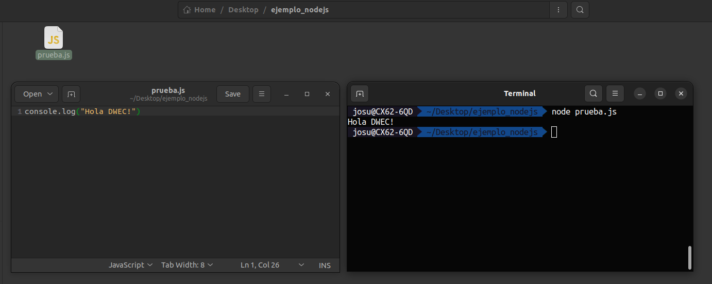
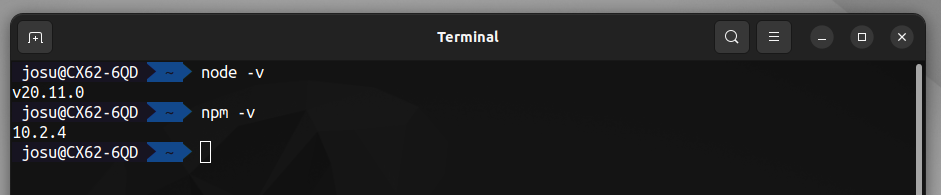
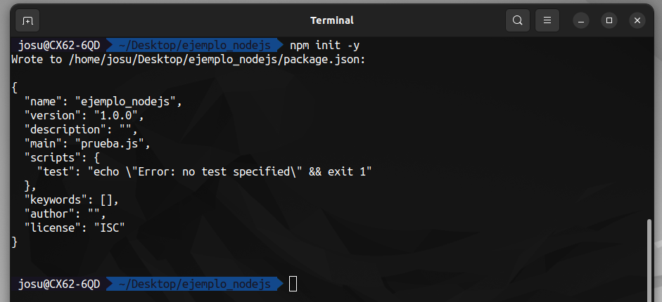
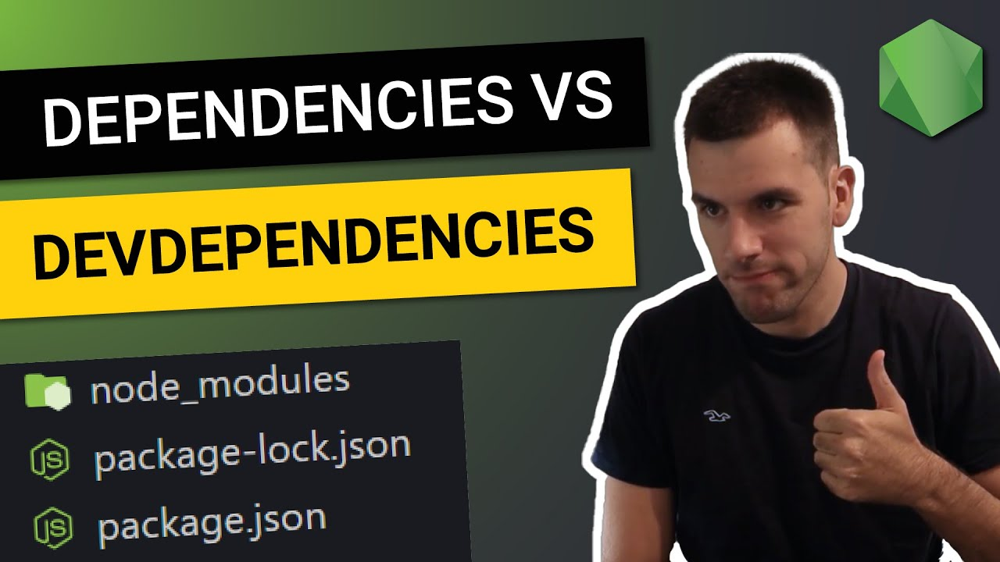
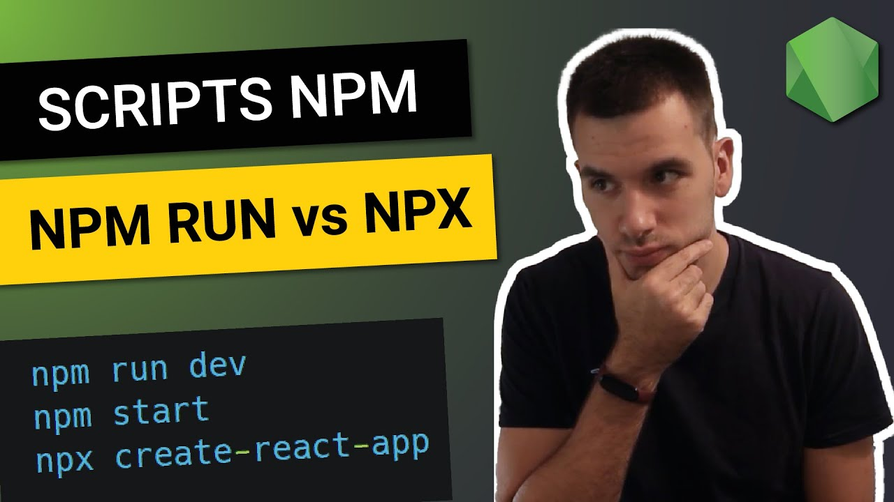
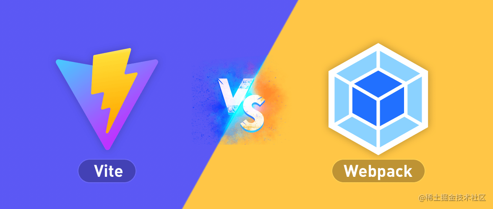
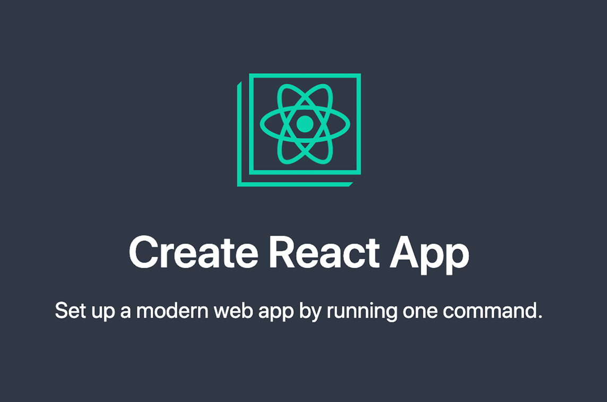
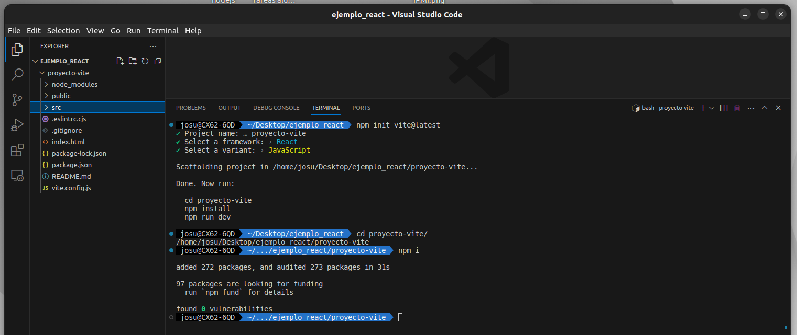

# DWEC UT05: Introducción a los frameworks: React.

## Creando un proyecto frontend con NodeJS

### ¿Por qué necesitas Node para un proyecto de desarrollo de front end?

Node es a menudo asociado con el desarrollo **backend**, pero eso no es del todo cierto. Si ves la descripción de un trabajo donde estén buscando un desarrollador de Node, entonces probablemente estén buscando un desarrollador BackEnd. Aun así usaras Node incluso si haces desarrollo de frontend.

<p align="center"> 

</p>

**Node** es un tiempo de ejecución de JavaScript. Ejecuta archivos de JavaScript fuera de un navegador. Hay dos formas de ejecutar código de JavaScript. Lo tienes como parte de un sitio web y lo ejecutas en todo el sitio web en un navegador, o lo ejecutas solamente en el archivo JavaScript con Node.

En este ejemplo tenemos un simple archivo JavaScript que imprime Hola Mundo en la consola.

```js
console.log("Hola DWEC!")
```

Si tenemos Node instalado, podemos ir a la terminal, buscar la carpeta donde está el archivo y luego ejecutarlo con Node, así, puedes ver como se ejecuta el archivo y el resultado está en la consola. Eso es Node en realidad, una herramienta que ejecuta archivos JavaScript por sí mismos.

<p align="center"> 

</p>

### La gran utilidad de Node en el sistema

JavaScript puede acceder a los elementos HTML y  modificarlos. Esa es el punto principal de tener JavaScript en primer lugar. En Node, no hay archivo HTML circundante al cual JavaScript pueda acceder. JavaScript se ejecuta por sí mismo.

Por otro lado, en Node JavaScript **puede acceder a tus archivos del sistema**, **leerlos** y **escribirlos**. Por ejemplo, <u>puedes ejecutar scripts que generen el esqueleto de tu proyecto en tu computadora por ti</u>. Puedes ejecutar <u>comprobaciones en tus archivos y automáticamente corregir los errores</u> o <u>puedes ejecutar tus archivos de prueba</u>.

Entonces, para responder a la pregunta, <u>*¿Por qué la gente asocia Node con el desarrollo Back End?*</u> Porque si el código backend es escrito en JavaScript, los servidores necesitan una forma de ejecutarlo sin el navegador. Entonces sí, si tú eres un desarrollador back end usando JavaScript, vas a usar Node. Pero Node es muchísimo más que eso.
 
Pero si somo dedarrolladores frontend, <u>*¿por que necesitamos Node?*</u> Pues por que nos va a facilitar la vida cuando estemos preparando el proyecto, instalando librerias, ayudandonos a desplegar y hacer pruebas en local y gestionando los transpiladores para al final obtener una app que podamos subir a un servidor web. 

## Gestionar proyecto con node y npm

**NPM** de las siglas *Node Package Manager*, es el gestor de paquetes de NodeJS. Este gestor de paquetes (muy similar al concepto de apt-get en GNU/Linux), nos permitirá instalar de forma muy sencilla y automática paquetes Javascript (tanto de Node como Javascript para el navegador) para poder utilizarlos y mantenerlos en los proyectos o sistemas que utilicemos.

Para instalar node ve a [nodejs.org](https://nodejs.org/en) e instala la última versión estable, marcada con LTS. Si aún no estás seguro de que ya tienes Node, también puedes ir a tu terminal y ejecutar el código `node -v` para comprobarlo. Si obtienes un número de versión, tienes Node.

<p align="center"> 

</p>

En el caso de que no tengamos node instalado en nuestro sistema, se nos mostrará un mensaje de error como `node: command not found` o similar, en cuyo caso deberemos proceder a instalarlo.

En este primer contacto vamos a repasar el **scaffolding** (estructura de carpetas) de un proyecto de frontend y como crear desde cero un proyecto con NPM.

### Inicializar un proyecto

El primer paso será acceder a nuestra carpeta de proyectos y una vez allí, crear la carpeta del proyecto actual e inicializarlo. Por lo tanto, nuestro primer paso debe ser elegir un buen nombre para la carpeta de nuestro proyecto.

```bash
# En este caso se estan utilizando comando de linux.
# Si estais trabajando con entorno Windows utilizar los comando y rutas adecuadas
cd /home/usuario/proyectos
mkdir frontend-project
cd frontend-project
```

Algunos consejos sobre los nombres de directorios para proyectos:

* Utiliza siempre minúsculas.
* No utilices espacios en el nombre. Usa guiones en su lugar.
* Evita el uso de carácteres especiales, signos de puntuación, etc...

Una vez en la carpeta raíz del proyecto, sería una buena idea preparar `git` con un `git init` para llevar el control de versiones del proyecto cuanto antes. También sería un buen momento para crear un archivo `.gitignore`, que indique las carpetas que vamos a ignorar con `git`. La carpeta **node_modules/** debe estar obligatoriamente en dicho fichero.

Una vez hecho esto, inicializamos el proyecto con NPM, escribiendo `npm init -y`. Esto creará un fichero llamado `package.json` del que hablaremos más adelante y que contendrá toda la información del proyecto:

<p style="text-align: center"> 

</p>

El parámetro `-y` de `npm init` omite el asistente interactivo, creando el `package.json` con los valores por defecto directamente y sin preguntarnos. Si prefieres utilizar el asistente, omite ese parámetro.

Os dejo un video donde explica con ejemplos muy sencillos como instalar y utilizar algunas librerias en un proyecto sencillo. Además, explica la diferencia entre dependencias y dependencias de desarrollo.

<p align="center"> 
<a href="https://www.youtube.com/watch?v=7HTfEG_sj9s">

</a>
</p>

Y este otro donde nos explica como utilizar los scripts de un proyecto, además de definir nuestros propios scripts para un proyecto en concreto.

<p align="center"> 
<a href="https://www.youtube.com/watch?v=QxY5o1eCoxU">

</a>
</p>

Estos videos nos ayudaran a entender los conceptos relativos a los poryectos con NodeJS que nos serviran para desarrollar un proyecto con React y todos los módulos que nos ayudara.

## Nuestro "Hello World" en React

Ya hemos visto como inicializar proyectos con npm para poder trabajar con dependencias y poder ejecutar comandos que pueden (llegar a) levantar servidores para comprobar los cambios que vamos realizando. Además, ya hemos visto como incluir las librerieas de **React** y **ReactDOM** junto con **BabelJS** para crear componentes utilizando sintaxis **JSX**.

Aunque ya hemos dicho que no es la manera mas correcta de utilizar React, pero entonces, ¿como hacemos para empezar un proyecto con React?

Los **empaquetadores** de JavaScript son (casi) indispensables para desarrollar aplicaciones web modernas y completas. Se encargan de *empaquetar* todos nuestros archivos, *transformarlo*, *optimizarlos* y *minimizarlos* para *mejorar* su funcionamiento tanto en desarrollo como en producción.

<p align="center"> 

</p>

<p align="center">
<a href="https://kinsta.com/es/blog/rollup-vs-webpack-vs-parcel/">
Comparando Bundlers (Empaquetadores) de JavaScript</a>
</p>

### CRA (create-react-app)

Vamos a hacer una breve mención a `create-react-app` ya que ha sido durante mucho tiempo el comando por excelencia para iniciar proyecto con React. Hoy en día los desarrolladores de React [ya no lo recomiendan](https://www.youtube.com/watch?v=h1WLN9Gzbwc) y ademas han dejado de actualizarla, pero si alguien quiere probarlo para ver el funcionamiento aqui tiene el enlace a la documentación antigua del proyecto de React ([enlace](https://create-react-app.dev/docs/getting-started))

<p align="center"> 

</p>

### Vite

En su lugar vamos a utilizar Vite (palabra en francés para "rápido", pronunciado como /vit/ como "veet") es una herramienta de compilación que tiene como objetivo proporcionar una experiencia de desarrollo más rápida y ágil para proyectos web modernos. Consta de dos partes principales:

* Un servidor de desarrollo que proporciona mejoras enriquecidas de funcionalidades sobre módulos ES nativos, por ejemplo Hot Module Replacement (HMR) extremadamente rápido.

* Un comando de compilación que empaqueta tu código con Rollup, preconfigurado para generar recursos estáticos altamente optimizados para producción.

<p align="center"> 

<a href="https://www.youtube.com/shorts/GQqT_qvW0Q4">Como crear proyecto con vite rapidamente.</a>
</p>