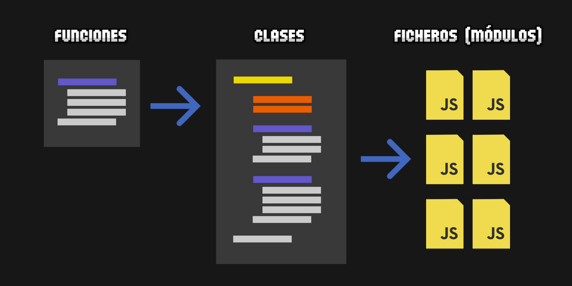
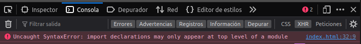

# DWEC UT05: Introducción a los frameworks: React.

## ¿Que son los módulos?

Uno de los principales problemas que ha ido arrastrando Javascript desde sus inicios es la dificultad de organizar de una forma adecuada una aplicación grande, con muchas líneas de código. En muchos lenguajes de programación, cuando un programa crece, se comienza a estructurar en funciones. Posteriormente, se traslada a `clases`, que contienen variables (*propiedades*) y funciones (*métodos*). De esta forma organizamos de forma más lógica el código de nuestro programa. Sin embargo, no será suficiente.

Tener todo el código en un sólo fichero Javascript se vuelve confuso y complejo en cuanto el código crece. En la mayoría de los lenguajes de programación, el código se divide en ficheros diferentes de modo que, por ejemplo, cada clase está localizada en un fichero separado. De esta forma, todo queda mucho más organizado e intuitivo, y es fácil de localizar, cambiar y mantener, aunque crezca con el tiempo.

<p align="center"> 

</p>

En el Javascript del **«lado del cliente»** (navegador), esto se complica un poco, ya que presenta algunas problemáticas que no existen en otros lenguajes de programación. Hay que tener bien presente que cuando accedemos a una página o aplicación web, estamos accediendo a un servidor, desde donde se está descargando el código Javascript (hacia nuestro navegador) y una vez descargado, se ejecuta en nuestro cliente.

## Módulos ES

A partir de `ECMAScript 2015` se introduce una característica nativa denominada **Módulos ES** (**ESM**), que permite la importación y exportación de fragmentos de datos entre diferentes ficheros Javascript, eliminando las desventajas que teníamos hasta ahora y permitiendo trabajar de forma más flexible en nuestro código Javascript.

Para trabajar con módulos tenemos a nuestra disposición las siguientes palabras clave:

* `export`    - Pone los datos indicados (variables, funciones, clases...) a disposición de otros ficheros
* `import`    - Incorpora datos (variables, funciones, clases...) desde otros ficheros `.js` al código actual.
* `import()`  - Permite importar módulos de forma más flexible, en tiempo real (imports dinámicos).

Mediante la palabra clave `export` crearemos lo que se llama un módulo de exportación que contiene datos. Estos datos pueden ser variables, funciones, clases u objetos más complejos (a partir de ahora, elementos). Si dicho módulo ya existe, podremos ir añadiendo más propiedades.

Por otro lado, con la palabra clave `import` podremos leer dichos módulos exportados desde otros ficheros y utilizar sus elementos en el código de nuestro fichero actual.

Veamos un ejemplo sencillo para ver el funcionamiento de `import` y `export` en su modo más básico. Tenemos un fichero `constants.js` donde vamos a exportar una constante numérica.

```js
// Fichero constants.js
export const magicNumber = 42;
```

Por otro lado, en el fichero `index.js`, vamos a traernos esa constante numérica para utilizarla en el fichero actual.

```js
// Fichero index.js
import { magicNumber } from "./constants.js";

console.log(magicNumber);   // 42
```

Antes de empezar, recuerda que para poder utilizar `export` o `import` en nuestro código Javascript que se ejecuta directamente en el navegador, debemos cargar el fichero `.js` con la etiqueta y atributo `<script type="module">` para indicarle que utilizaremos módulos. Si no lo hacemos, obtendremos un error.

<p align="center"> 

</p>

> Puedes encontrar mas información acerca de diferentes tipos de módulos en el siguiente [enlace](https://lenguajejs.com/automatizadores/introduccion/commonjs-vs-es-modules/)


## Exportar módulos

Por defecto, un fichero Javascript no tiene módulo de exportación si no se usa un `export` al menos una vez en su código. Si se usa al menos un `export`, entonces tendrá un objeto llamado módulo de exportación, donde puede tener uno o múltiples datos. Existen varias formas de exportar datos mediante la palabra clave de Javascript export:

| Forma | Descripción |
|-------|-------------|
| `export ... `| Declara un elemento o dato, a la vez que lo añade al módulo de exportación. |
| `export { name }` | Añade el elemento `name` al módulo de exportación. |
| `export { name as newName }` | Añade el elemento `name` al módulo de exportación con el nombre `newName`. |
| `export { n1, n2, n3... ` | Añade los elementos indicados ( `n1 , n2 , n3 ...`) al módulo de exportación. |
| `export * from "./file.js"` | Añade todos los elementos del módulo de `file.js` al módulo de exportación. | 
| `export default ..` | Declara un elemento y lo añade como módulo de exportación por defecto. |

### Declaración y exportación

Existen varias formas de exportar elementos. La más habitual, quizás, es la de simplemente añadir la palabra clave `export` a la izquierda de la declaración del elemento Javascript que deseamos exportar, ya sea una variable, una constante, una función, una clase u otro objeto más complejo.

```js
export let number = 42;                  // Se añade la variable number al módulo
export const hello = () => "Hello!";     // Se añade la función hello al módulo
export class CodeBlock { };              // Se añade la clase vacía CodeBlock al módulo
```

### Exportación post-declaración

Si vienes del mundo de `NodeJS`, es muy probable que te resulte más intuitivo exportar módulos al final del fichero, ya que es como se ha hecho siempre en Node con los `module.exports`. Esta forma tiene como ventaja que es mucho más fácil localizar la información que ha sido exportada, ya que siempre estará al final del fichero.

```js
let number = 42;
const hello = () => "Hello!";
const goodbye = () => "¡Adiós!";
class CodeBlock { };

export { number };                   // Se crea un módulo y se añade number
export { hello, goodbye as bye };    // Se añade saludar y despedir al módulo
export { hello as greet };           // Se añade otroNombre al módulo
```

### Exportación por defecto

Ten en cuenta que al exportar elementos y crear un módulo de exportación, lo que realmente creamos es un **objeto** donde las propiedades son los nombres de los elementos (constantes, variables, funciones, clases...). Existe una modalidad de exportación que es conocida como exportación por defecto.

Para realizarla, sólo tenemos que añadir la palabra clave `default` tras el `export`. En ese caso, estaremos creando un elemento en nuestro módulo de exportación que tendrá el nombre `default` y será considerado el elemento principal (elemento por defecto). Sólo puede haber un elemento llamado `default` por módulo de exportación, por lo que tampoco se puede hacer más de un `export default` por fichero.

```js
export const number = 42;    // Declaración y exportación
export default "Manz";       // Exportación por defecto
```

Observa que si utilizamos el `export default`, no es posible declarar la variable con `var`, `let` o `const`, puesto que ese nombre sería inútil.

## Importar módulos

En Javascript, podemos utilizar `import` para hacer la operación inversa a `export`. Si habíamos mencionado que con `export` ponemos datos o elementos de un fichero `.js` a disposición de otros, con `import` podemos cargarlos y utilizarlos en el código de nuestro fichero actual.

Existen varias formas de importar código utilizando la palabra clave `import`.

| Forma | Descripción |
|-------|-------------|
| `import { nombre } from "./file.js"` | Importa el elemento `nombre` de file.js. |
| `import { nombre as newName } from "./file.js"` | Importa el elemento `nombre` de file.js como `newName`. |
| `import { n1, n2... } from "./file.js"` | Importa los elementos indicados desde file.js. |
| `import nombre from "./file.js"` | Importa el elemento por defecto de file.js como `nombre`. |
| `import * as name from "./file.js"` | Importa todos los elementos de file.js en el objeto `name`. |
| `import "./file.js"` | Ejecuta el código de file.js. No importa ningún elemento. |
| `import { name } from "https://web.com/file.js"` | Descarga el fichero e importa el elemento `name` de su módulo. |

### Importación por nombre

La forma más habitual de importar elementos es a través de la denominada importación nombrada, donde utilizamos la palabra clave `import` indicando el nombre de los elementos a importar en el interior de las llaves `{ }`, todo ello desde el módulo de exportación del fichero `file.js`.

```js
import { nombre } from "./file.js";
import { number, element } from "./file.js";
import { brand as brandName } from "./file.js";
```

### Importación por defecto

Hasta ahora, hemos utilizado importaciones con nombre, donde indicamos en todo momento el nombre de los elementos que queremos importar. Sin embargo, es posible exportar/importar elementos por defecto.

Una importación por defecto lo único que hace es buscar el elemento llamado `default` e importarlo con el nombre indicado en el `import`:

```js
import nombre from "./math.js";
```

Observa que en este caso, la diferencia es que no hemos indicado las llaves `{ }` al indicar el nombre del elemento, lo que hará que importe el elemento `default` y lo renombre a `nombre`. En el caso de que no exista ninguna propiedad `default` en el módulo de exportación se generará un objeto vacío.

### Importación masiva

Otra modalidad de importación interesante es aquella donde podemos hacer una importación masiva. Es decir, si utilizamos el símbolo `*` a la hora importar, estaremos indicando que se deben cargar todos los elementos del módulo de exportación del fichero indicado.

En esta modalidad, es obligatorio utilizar el `as` seguido del nombre del elemento, ya que debemos indicar un nombre para crear un objeto que contendrá todos los elementos importados:

```js
import * as module from "./file.js";
```

Observa que en este caso, la diferencia es que no hemos indicado las llaves `{ }` al indicar el nombre del elemento, lo que hará que importe el elemento `default` y lo renombre a `nombre`. En el caso de que no exista ninguna propiedad `default` en el módulo de exportación se generará un objeto vacío.